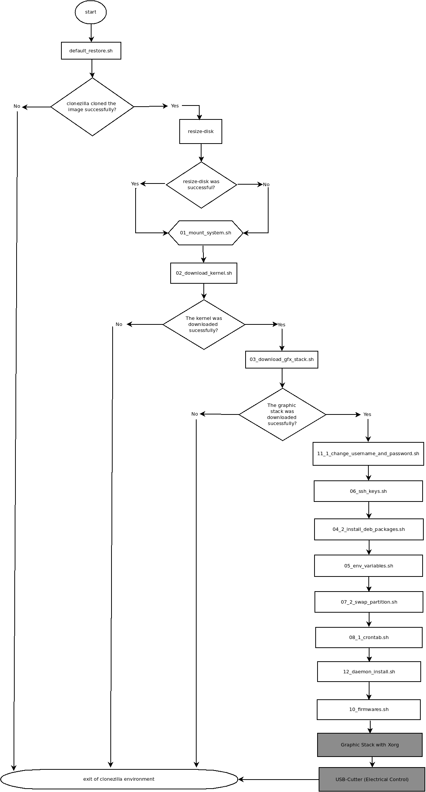
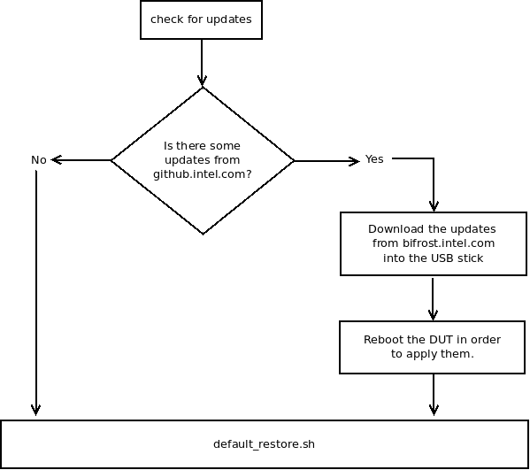
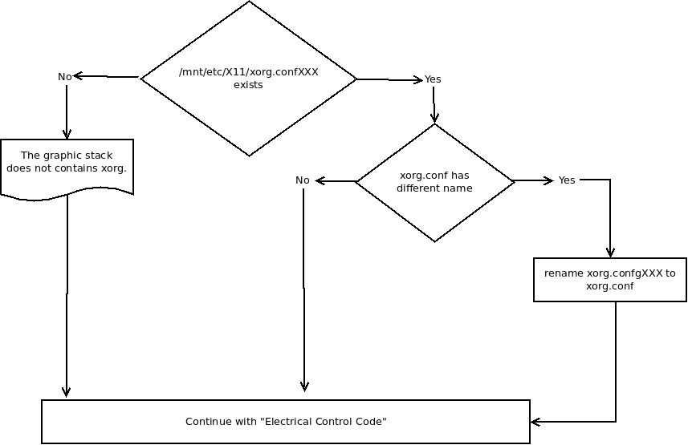
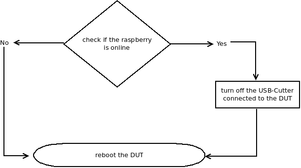

.. header:: LinuxGraphics | `01.org <https://01.org/linuxgraphics>`_

.. contents:: |table_of_contents|

.. setting the alias for the images.

Clonezilla environment |clonezilla_image|
-----------------------------------------
`The purpose of clonezilla is to clone a clean linux distro and setup the DUT with
custom configurations in order to run specific suites.`

`Clonezilla launches bash scripts in order to to fulfill the mentioned purpose.`

`Most of the clonezilla scripts are handled by`
`run.sh <https://github.intel.com/linuxgraphics/gfx-qa-tools/blob/master/raspberry/clonezilla_usb/custom/packages/all/run.sh>`_ `script.`

`So far there are three main actions that clonezilla performs which are :`

    .. list-table:: Actions Performed by Clonezilla
       :widths: 2 8 20
       :header-rows: 1

       * - #
         - Action
         - Description
       * - 1
         - Setup a DUT
         - Setup with a specific kernel/graphic stack to run anything.
       * - 2
         - Setup a DUT for intel-gpu-tools
         - run intel-gpu-tools (fast-feedback/igt-all/custom testlist) and report to TRC
       * - 3
         - Setup a DUT for rendercheck
         - run rendercheck with ezbench and report to TRC

The code inside of `run.sh <https://github.intel.com/linuxgraphics/gfx-qa-tools/blob/master/raspberry/clonezilla_usb/custom/packages/all/run.sh>`_
---------------------------------------------------------------------------------------------------------------------------------------------------

*************
**(usb.cfg)**
*************

This script is used to match the current USB UUID with the one in bifrost.intel.com.

    .. list-table:: Raspberry Current Table
       :widths: 30 30 30 30
       :header-rows: 1

       * - Raspberry-01
         - Raspberry-02
         - Raspberry-03
         - Raspberry-04
       * - switch-01
         - switch-01
         - switch-01
         - switch-01
       * - switch-02
         - switch-02
         - switch-02
         - switch-02
       * - switch-03
         - switch-03
         - switch-03
         - switch-03
       * - switch-04
         - switch-04
         - switch-04
         - switch-04
       * - switch-05
         - switch-05
         - switch-05
         - switch-05
       * - switch-06
         - switch-06
         - switch-06
         - switch-06
       * - switch-07
         - switch-07
         - switch-07
         - switch-07
       * - switch-08
         - switch-08
         - switch-08
         - switch-08

This file is downloaded from bifrost.intel.com from "/home/shared/gitlist/gfx-qa-tools"
folder in order to have the newest file from
`github.intel.com <https://github.intel.com/linuxgraphics/gfx-qa-tools>`_,
the UUID from the current USB attached to the DUT (from scripts partition) is
obtained in order to know exactly the following values :

- The raspberry system : which is the raspberry that corresponds to the current DUT.
- The switch (for electrical control) : which is the switch number that the
   corresponds to the current DUT.

Once obtained the raspberry system and the switch values, this will be used to
download the configurations file, which are :

- **config.cfg** : This configuration file is used during clonezilla environment
   for task such as clone a image, install debian packages, etc.
- **config.yml** : This configuration file is used in Ubuntu environment for
   several tasks such as setup the DUT, run suites, etc.

*******************************
**(intel-gpu-tools test list)**
*******************************

|testlist_image|

The aim of this part of the code is to have a test list in order to run intel-gpu-tools in the DUT.

    .. list-table:: ``intel-gpu-tools test list``
       :widths: 15 15 80
       :header-rows: 1

       * - default_package
         - blacklist_file
         - Description
       * - igt_all
         - (yes/no)
         - A brief description regarding the possible values :
            * ``yes`` : The user must specify the test list through `I.E.M <http://bifrost.intel.com:2020/iem>`_, please see the valid `format <http://linuxgraphics.intel.com/deb/WW5/Monday__JAN__07-03-04__intel-gpu-tools/testlist.d/core_auth.testlist>`_.
            * ``no``  : The test list to run will include all IGT test cases except the ones that starts with ("gem_concurrent*"/"amdgpu*").
       * - igt_clone_testing
         - (N/A)
         - Clonezilla will try to download the test list file called **"clone.testlist"**
            from bifrost.intel.com, if this step can not be performed
            `run.sh <https://github.intel.com/linuxgraphics/gfx-qa-tools/blob/master/raspberry/clonezilla_usb/custom/packages/all/run.sh>`_
            will stops the execution in clonezilla environment.
       * - igt_fast_feedback
         - (N/A)
         - `run_IGT.py <https://github.intel.com/linuxgraphics/gfx-qa-tools/blob/master/igt/run_IGT.py>`_
               will executed the common fast-feedback.testlist provided by FI team into intel-ci folder.

``:: This part of the code stops clonezilla execution if this fails.``

*****************************
**(Graphic Stack with Xorg)**
*****************************

|xorg_image|

The intention of this part of the code is to rename the file xorg.conf only if
this is different to the original one.

|xorg_diagram|

***********************************
**(USB-Cutter Electrical control)**
***********************************

|electrical_image|

This part of the code is in charged to turn off the usb-cutter hardware through
to the raspberry (only if the last one is available).

**workflow** |workflow|

|electrical_diagram_control|

The functions inside of `run.sh <https://github.intel.com/linuxgraphics/gfx-qa-tools/blob/master/raspberry/clonezilla_usb/custom/packages/all/run.sh>`_
-------------------------------------------------------------------------------------------------------------------------------------------------------

****************
1. **(updates)**
****************

    |updates_image|

    The aim of this function is to check new commits from `gfx-qa-tools <https://github.intel.com/linuxgraphics/gfx-qa-tools>`_
    and download them into the USB scripts partition.

    `How this works ...`

        - **bifrost.intel.com** server has a cron job that constantly is checking if there
            is a commit for `gfx-qa-tools <https://github.intel.com/linuxgraphics/gfx-qa-tools>`_,
            if yes this cron job download it into /home/shared/gitlist/gfx-qa-tools and notify to the team.
        - The **USB partition** called scripts has a git folder that contains a SHA-1,
            this function compares this SHA-1 with the one in bifrost server,
            if the USB SHA-1 commit is different this function will sync up the
            files between this two directories and then the DUT will be rebooted
            in order to apply the changes.

    **workflow** |workflow|

|updates_diagram|

The scripts inside of `run.sh <https://github.intel.com/linuxgraphics/gfx-qa-tools/blob/master/raspberry/clonezilla_usb/custom/packages/all/run.sh>`_
------------------------------------------------------------------------------------------------------------------------------------------------------

|terminal_image|

****************************
1.  **(default_restore.sh)**
****************************

|restore_image|

    `The aim of this script is to restore the default image in config.cfg from asgard.intel.com server through clonezilla.`

    `How this works ...`

    All the following steps needs to be True in order to continue, otherwise
    this script will launch a exit code different of 0.

        1. Check if the variable "default_image" is not empty in config.cfg.
        2. Check if the image exists in asgard.intel.com.
        3. Check how many hard disks has the DUT and select the bigger one.
        4. Check that the DUT's hard disk will be equal or greater than the one image to download.
        5. Finally try to restore the image in the DUT.

    ``:: This script stops clonezilla execution if this fails.``

********************
2. **(resize-disk)**
********************

|gparted_image|

    In order to this script works the following GPT table is needed:

    .. list-table:: ``GPT Table Required!``
       :widths: 30 30 30
       :header-rows: 1

       * - Partition
         - Mount Point
         - Description
       * - ├─sda1
         - /boot/efi
         - EFI System Partition
       * - ├─sda2
         - [SWAP]
         - SWAP Partition
       * - ├─sda3
         - /
         - Root System Partition (ext4 filesystem)

    `How this works ...`

    All the following steps needs to be True in order to continue, otherwise this
    script will launch a exit code different of 0.

        1. Check the free disk space to grow.
        2. Fix the cloned GTP table.
        3. Resize the root partition.
        4. Check a Linux ext2/ext3/ext4 file system.
        5. Allocate the unused disk space in the hard disk.

***************************
3. **(01_mount_system.sh)**
***************************

    The aim of this script is to mount the ext4 partition downloaded into "/mnt"

    `How this works ...`

        1. Check how many hard disks has the DUT and select the bigger one to be mounted into "/mnt".
        2. Mount the ext4 partition into "/mnt".
        3. Mount system folders such as : "/dev", "/proc", "/sys" into "/mnt"
        4. Copy local "resolv.conf" file into "/mnt/etc" (see "man resolvconf").

******************************
4. **(02_download_kernel.sh)**
******************************

    The aim of this script is to mount the kernel folder from bifrost.intel.com
    to the DUT with "sshfs" (see "man sshfs") and copy the select commit to the DUT.

    `How this works ...`

        1. Create a local folder in clonezilla environment.
        2. Read the variable "kernel_branch" from config.cfg in order to mount it locally with "sshfs".
        3. Find the kernel path locally in order to locate the debian packages.
        4. Copy the debian packages to the DUT into "/home/custom/kernel/packages"

    ``:: This script stops clonezilla execution if this fails.``

*********************************
5. **(03_download_gfx_stack.sh)**
*********************************

    The aim of this script is to mount the graphic_stack folder from **bifrost.intel.com**
    to the DUT with "sshfs" (see "man sshfs") and copy the select graphic stack id to the DUT.

    `How this works ...`

        1. Create a local folder in clonezilla environment.
        2. Reads the variable "gfx_stack_code" from config.cfg in order to mount it locally with "sshfs".
        3. Find the graphic stack path locally in order to locate the debian package.
        4. Copy the debian package to the DUT into "/home/custom/graphic_stack/packages"

    ``:: This script stops clonezilla execution if this fails.``

*********************
6. **(11_chroot.sh)**
*********************

    The aim of this script is to run command or interactive shell with special root directory.

    `How this works ...`

        1. Copy "/root/custom" folder to "/mnt/root" if this does not exists.
        2. Does a mount for ("/proc", "/sys", "/dev") with bind as parameter in order to call attaches only (part of) a single filesystem.
        3. Run in a sub-shell the script "11_1_change_username_and_password.sh" to perform the following actions :
            - Change the username/home folder from the "gfx" to the user setup in config.cfg with the variable "dut_user".
            - Change the group from "gfx" to the user setup in config.cfg with the variable "dut_user".
            - Change the password to the password setup in config.cfg with the variable "dut_password".

***********************
7. **(06_ssh_keys.sh)**
***********************

|ssh_keys|

    The aim of this script is to setup the ssh keys in the DUT.

        `How this works ...`

            1. Setup the following files for a normal user and root user.
                - authorized_keys
                - config
                - id_rsa
                - id_rsa.pub
                - known_hosts
            2. Setup ssh banners for logging in the system

*********************
8. **(04_chroot.sh)**
*********************

        The aim of this script is to run command or interactive shell with special root directory.

        `How this works ...`

            1. Copy "/root/custom" folder to "/mnt/root".
            2. Does a mount for ("/proc", "/sys", "/dev") with bind as parameter in order to call attaches only (part of) a single filesystem.
            3. Run in a sub-shell the script "04_2_install_deb_packages.sh" to perform the following actions:
                - Install the debian packages for the kernel located in the dut into "/home/custom/kernel/packages"
                - Install the debian package for the graphic stack located in the dut into "/home/custom/gfx_stack/packages"
                - If the graphic contains Xorg and the binary is not in the system, this part will copy it from ""/home/custom/gfx_stack/Xorg" to "/usr/bin/"
                - If the graphic contains Xorg and xorg.conf file is not in the system, this part will copy it from ""/home/custom/gfx_stack/xorg.conf" to "/etc/X11"
                - If the graphic contains Xorg this part will setup the appropriate permissions for the mentioned files in the previous steps.
            4. Setup the grub parameters in config.cfg
            5. Update initram-fs if there was an kernel installation.
            6. Disable graphic user interface (if this was setup to off in config.cfg)
            7. Enable TTYs autologin in the system and update systemctl to apply the changes.
            8. Setting rsyslog configuration file.

****************************
9. **(05_env_variables.sh)**
****************************

    The aim of this script is to setup miscellaneous conditions in the DUT.

    `How this works ...`

        1. Setup the DUT's hostname.
        2. Setup the DUT's static IP.
        3. Download `gfx-qa-tools <https://github.intel.com/linuxgraphics/gfx-qa-tools>`_ from bifrost.intel.com into "/home/user/dev".
        4. Copy the configurations files (config.cfg/config.yml) to the DUT into "/home/custom"
        5. Setup sudoers file in the DUT.
        6. Setup hwclock for rtcwake (for PM test cases)
        7. Setup of tune2fs for the following actions:
            - Disable Filesystem Check on Boot.
            - Change the behavior of the kernel code when errors are detected.
        8. Add DUT user to TTY group.
        9. If "graphical_environment" variable is setup to "on", enable autologin in X.
        10. Setup PYTHONPATH environment variable.
        11. Setup resolved.conf file for DNS.

******************************
10. **(07_swap_partition.sh)**
******************************

    The aim of this script is to run command or interactive shell with special root directory.

    `How this works ...`

        1. Does a mount for ("/proc", "/sys", "/dev") with bind as parameter in order to call attaches only (part of) a single filesystem.
        2. Run in a sub-shell the script "07_2_swap_partition.sh" to perform the following actions:
            - Unmount the swap partition.
            - Create a new UUID for the swap partition.
            - Add the new UUID to the DUT's fstab.
            - Mount the swap partition.
            - Add the resume partition to the grub (for PM test cases).
            - Add defaults option to fstab.
            - Add fastboot parameter in grub.
            - Update the grub.
            - Disable printing of messages to the console.
            - Decrease raise network interfaces at the beginning to 15 sec (for a faster start).
            - Restart the network daemon in order to apply the changes.
            - Add DUT's information to issue.net file.

******************************
11. **(08_crontab_chroot.sh)**
******************************

|crontab|

    The aim of this script is to run command or interactive shell with special
    root directory.

    `How this works ...`

            1. Copy "/root/custom" folder to "/mnt/root".
            2. Does a mount for ("/proc", "/sys", "/dev") with bind as parameter in order to call attaches only (part of) a single filesystem.
            3. Run in a sub-shell the script "08_1_crontab.sh" to perform the following actions:
                - Setup crontab according to the "default_package" variable in config.cfg

*****************************
12. **(12_daemon_chroot.sh)**
*****************************

|daemon|

    The aim of this script is to run command or interactive shell with special
    root directory.

    `How this works ...`

            1. Copy "/root/custom" folder to "/mnt/root".
            2. Does a mount for ("/proc", "/sys", "/dev") with bind as parameter in order to call attaches only (part of) a single filesystem.
            3. Run in a sub-shell the script "12_1_daemon_install.sh" to perform the following actions:
                - If the "default_package" is igt in all of their flavours the following actions will be performed in the daemons setup in this script:
                   - Change the default username to "dut_user" username in config.cfg.
                   - Copy the daemons to "/etc/systemd/system".
                   - Enable the daemons in the DUT.
                   - Starts the daemons.

*****************************
13. **(10_firmwares.sh)**
*****************************

|firmwares|

    The aim of this script is to copy the firmwares (if any in the config.cfg) to the DUT.

    `How this works ...`

        1. Mount the "/home/shared/firmwares" directory from bifrost.intel.com to /home/firmwares.
        2. Copy the files setup in config.cfg to the DUT in "/home/custom/firmwares"

**workflow** |workflow|

|scripts_diagram|

Glossary
--------
    .. list-table::
       :widths: 10 30
       :header-rows: 1

       * - Acronym
         - Definition
       * - DUT
         - Device Under Test, each DUT represent a hardware connected to the automated system such as : NUCs, Laptops, Desktops, etc.

:Author:
    Humberto Israel Perez Rodriguez (humberto.i.perez.rodriguez@intel.com)
:Version: 1.0
:Year: 2018/02/05

