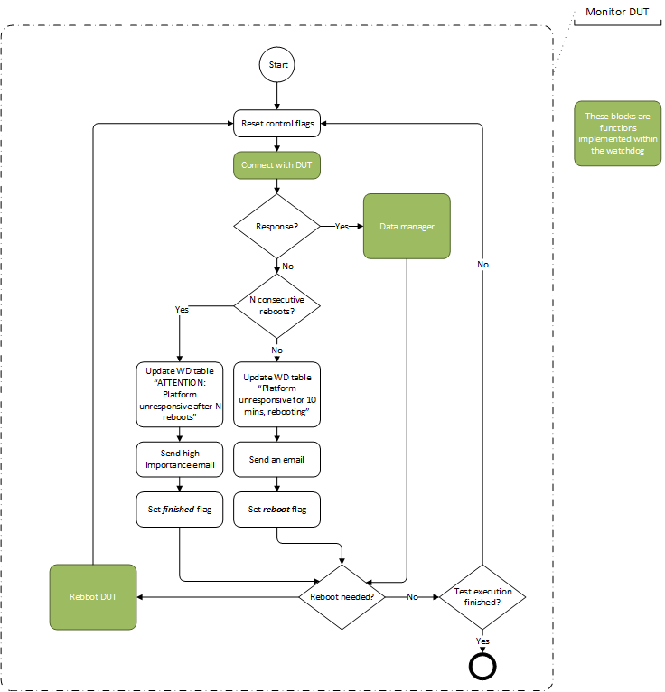
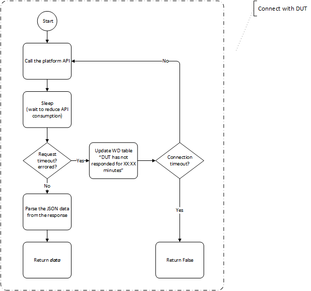
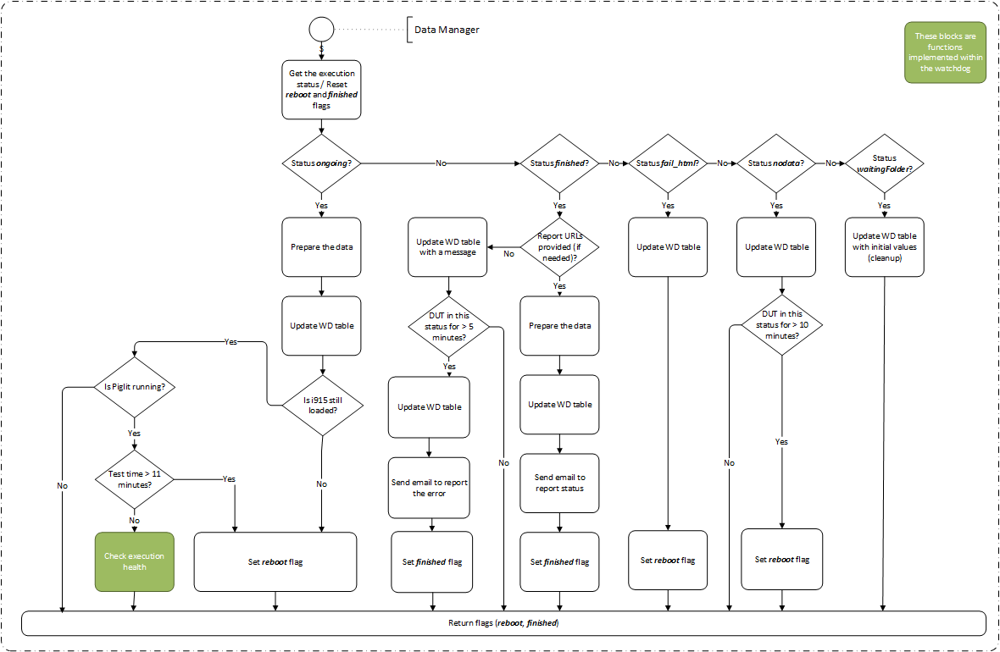
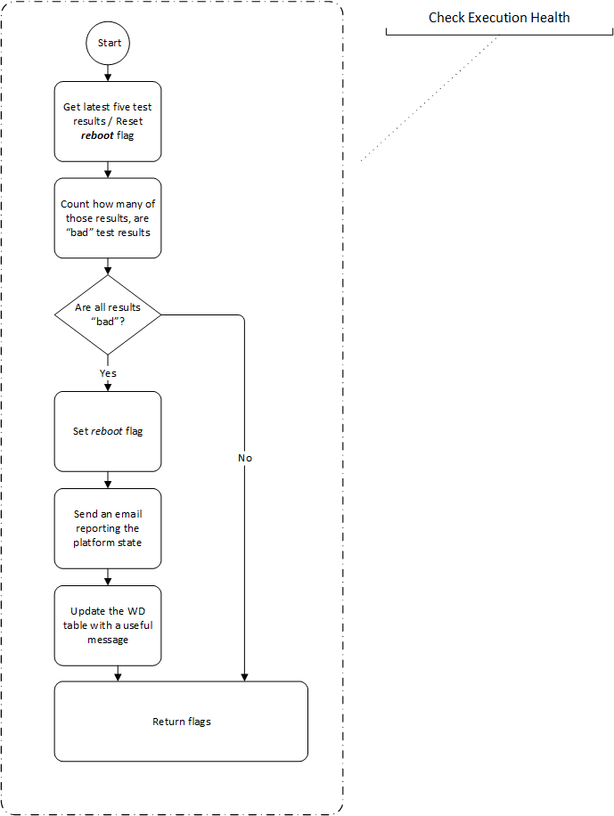
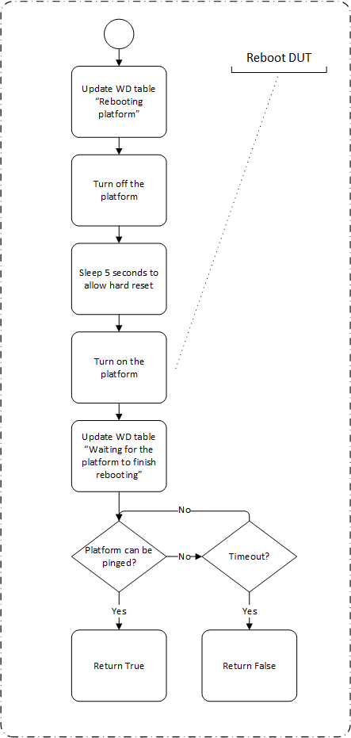
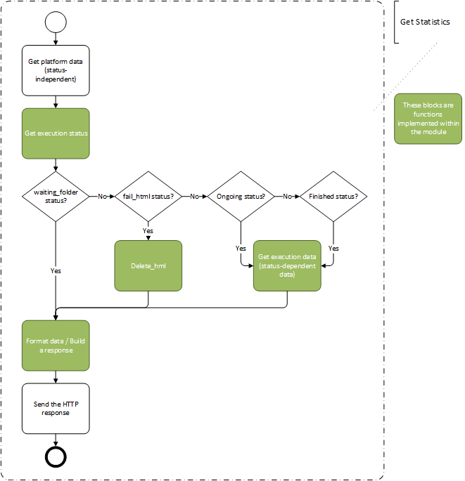

Watchdog - High Level Design
----------------------------

There are several graphics tests that are run in different platforms, like IGT, some of these tests are very resource
intensive, and because of this, many times while running these tests, the platform can become unresponsive and hangs,
which would block the test execution.

The watchdog is a two tier system that makes sure platforms (A.K.A. DUTs) don't hang during test execution.

The two pieces that form the watchdog are these:
 - **Watchdog (or monitor)**. This is the orchestrator of the system, when tests are being run, it sends HTTP requests to the platform being tested and take actions depending on the data received (or absence of it) in the response from the HTTP call. If the DUT becomes unresponsive for a specified amount of time, the DUT is considered hung so the watchdog reboots it.
 - **DUT Watcher (or reporter)**. This is a script hosted in every platform, which collects data from the current test execution, formats it, and sends it back when requested.

Watchdog Monitor
----------------

The following section shows design diagrams and describe the behavior of the watchdog monitor module and its methods.

**Monitor DUT**

The *monitor_dut()* is the main function in the watchdog and contains the control loop. If the platform (DUT) is responsive it gets its current information and updates the watchdog GUI. If the platform is not responsive it reboots it then updates the watchdog GUI. If the tests have finished running the watchdog is turned off.

**Connect With DUT**

The *connect_with_dut()* function tries to connects to a given platform by making an HTTP request to an API hosted in the platform in order to get data from it. It then returns the responsiveness status of the platform.

**Data Manager**

The *data_manager()* responsibility is to parse the data received, format it, and send it to the watchdog database which displays the data in the watchdog GUI. The data manager also analyses the test data to determine the status of the test execution.

**Check Execution Health**

The *check_execution_health()* method evaluates the stability of the current test execution by reviewing the results of the last five tests ran in the platform. If it is found that all those tests have failed, is is assumed something fishy is going on with the execution and the platform is rebooted.

**Reboot DUT**

The *reboot_dut()* method reboots a platform by doing a hard reset, it turns down the power of the switch, then turns it back on. The function then wait for the platform to be back online by pinging the platform until it replies back to the ping or until a timeout is reached.

DUT Watcher
-----------

As mentioned before, the DUT watcher plays the role of the reporter in this system so it collects data and sends it back when requested.
The following diagram shows the straightforward behavior of this module.

**Get Statistics**

The *get_statistics()* method is the main method of the dut_watcher. Its behavior is best described in the following diagram.

**Get Execution Status**

The *get_execution_status()* method purpose is to determine the current status of the test execution based on analyzing the existence and content of some directories and control files in the platform.

The following table shows those directories/files taken in consideration for determining the execution status along with the actions performed in some of these status.

+------------+------------+-----------+-------+------------+-------+-------------+------------------+
| iterations | iterationN | .igt_done | tests | tests[...] | html  | action      | status           |
+============+============+===========+=======+============+=======+=============+==================+
| False      | X          | X         | X     | X          | X     | None        | "waiting_folder" |
+------------+------------+-----------+-------+------------+-------+-------------+------------------+
| True       | False      | X         | X     | X          | X     | None        | "waiting_folder" |
+------------+------------+-----------+-------+------------+-------+-------------+------------------+
| True       | True       | False     | False | X          | X     | None        | "wrapping_up"    |
+------------+------------+-----------+-------+------------+-------+-------------+------------------+
| True       | True       | False     | True  | False      | False | None        | "waiting_folder" |
+------------+------------+-----------+-------+------------+-------+-------------+------------------+
| True       | True       | False     | True  | False      | True  | Delete html | "fail_html"      |
+------------+------------+-----------+-------+------------+-------+-------------+------------------+
| True       | True       | False     | True  | True       | False | Get data    | "ongoing"        |
+------------+------------+-----------+-------+------------+-------+-------------+------------------+
| True       | True       | False     | True  | True       | True  | Delete html | "fail_html"      |
+------------+------------+-----------+-------+------------+-------+-------------+------------------+
| True       | True       | True      | X     | X          | X     | Get data    | "finished"       |
+------------+------------+-----------+-------+------------+-------+-------------+------------------+

**Get Execution Data**

The *get_execution_data()* method collects information from the current test execution. For this information to be accurate this method has to consider the current status.

Basically there are two states that need to be considered when collecting execution data:
  - When the execution has finished. When a test execution has finished, Piglit (the test runner) creates a results.json file that includes the result of each test executed, so when in this state, the execution data can be obtained from this file.
  - When the execution is still ongoing. When the test execution is still in progress, that means there is no final results file yet, however Piglit creates one Json file for each one of the tests that have finished running, so when in this state, the execution data can be gathered by reading each one of these files.

Once the status of all the tests have been collected, some statistics are calculated based on these results, then all these values are returned.

**Format Data**

The *format_data()* method is in charge of standardizing the data that is to be sent back. The data that is sent back to the watchdog monitor needs to be in a standard format regardless of what info is available at any given time, this ensures the watchdog monitor handles the data properly every time.
